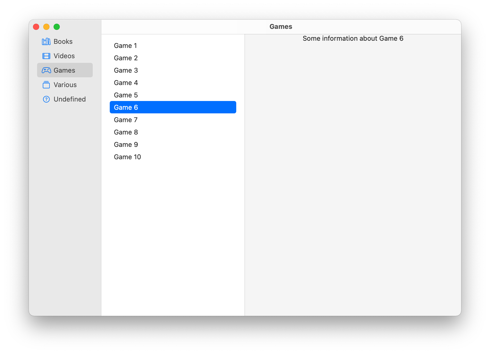

#  SwiftUI Sidebar + SplitView Example

A basic example implementing the 3 column split view as it has been introduced in iOS 14.
There are various examples and blog posts available on the web, but most of them do have some bugs or missing main feature.

## Goals

The goal for my example project was to:

- have a sidebar, remembering its current selection and highlighting it accordingly (as described by [Apples HIG](https://developer.apple.com/design/human-interface-guidelines/ios/views/split-views/))
- content is a regular Master/Detail respectively Primary/Secondary view, also remembering the current list selection

These seem rather basic goals, but most of them are not easily achieved with the examples and blog posts I've found so far.

The basic setup of a three column split view is created as shown below:

```swift
NavigationView {
    SidebarList()
    PrimaryView()
    SecondaryView()
}
```

Whenever a list row is selected from the sidebar, this influences the content of the primary view.  
When a list entry in the primary view is selected, this will influence the content of the secondary view.


<a href="_resources/macOS.png" target="_blank" ></a>
<a href="_resources/iPadOS.gif" target="_blank" ></a>


## The problems

During the implementation, I've hit the following problems and had to find appropriate solutions.

1. A programmatically triggered `NavigationLink` (i.e. setting the `selection` to the correct `tag`) will trigger the 
    display of the destination view, but it will not highlight the row/link as selected.  
    The programmatically selected sidebar entry will not be displayed as long as the sidebar is not shown by the user.
    (e.g. on an iPhone and 11" iPad the sidebar is hidden by default!)

2. Especially disturbing: the initially displayed `PrimaryView` and `SecondaryView` are treated as placeholders and are
    **replaced/overwritten** even though a user clicks the exact same rows which correspond to the content of those views.
    (=a `onDisappear` and a fresh `onAppear` is triggered.)

3. I have not found a modifier to set a list row to "selected" or "highlighted", even though the regular lists do support
    selection/highlighting when the corresponding `NavigationLink` is tapped by the user.
    You have to handle drawing the selection (e.g. the highlighted background) yourself.

4. Selecting a different primary view will not automatically invalidate/clear the secondary view. 

5. It might happen that a title set using the `navigationTitle` modifier, is not cleared/removed if a new view is displayed 
    which does not have such a modifier. 


## The key findings

1. **Do not use `NavigationLink` to change the views displayed in the primary view and secondary view.**  

    First: the `NavigationLink` cannot be used to properly track the selected item within the list due to the fact that the
    `tag:,selection:` arguments respectively the `isActive:` is mainly used to animate the navigation to a detail view respectively
    away from the detail view. Under some circumstances those bindings are set to `nil` and therefore the selection 
    is mysteriously cleared. But we want that the selection persists!  
    Therefore I've introduced `selectedCategory` and `selectedItem` in as storage. They are set whenever a tap action happens on the list row.
    I use an artificial `activatedNavigationLink` to trigger/track the navigation state. Whenever `activatedNavigationLink` is set to 
    `nil` this is ignored and not propagated to the selection variables.  
    This means: I have used regular `Button` views to selection within the list. (I used `PlainButtonStyle` which does not have a lot of fancy
    state animations.)
    
2. **Highlighting the list selection requires custom list row background drawing.**  

    SwiftUI has no modifier to "select" or "highlight" a row within a list. You can either modify the row displayed by appending
    a chevron or you can override the list background by using the `listRowBackground` modifier.
    If you choose the later approach you will be sad to learn that you will have to use `Button` views in your list instead of `NavigationLink`
    views. My tests to fully control the background drawn by the `NavigationLink` when a row is selected did never succeed.
    Alternatively it's possible to use a "chevron highlighting approach", to highlight the currently selected row.

3. **Do not expect all three columns being displayed at the same time on a "small iPad" (10.2" or 11")**

    If not all three columns are shown, there will always be an ugly "< Back" button in the top left similar to the iPhones.  
    Only a 12.9" iPad Pro held in landscape mode will show the button the show/hide the sidebar.
    Use `.previewLayout(.fixed(width: 1195, height: 700))` with a width of atleast 1195 points to enable the full regular width.

4. **It is not possible to switch between three column split view and two column split view.**

    If you want three column mode, you will have to provide 3 child views to `NavigationView`. Conditionally omitting the
    third view will not change the layout. There will simply be a missing secondary view!
    Based on the main screens horizontal size class you can create a one child single stack view or a three column layout view.
